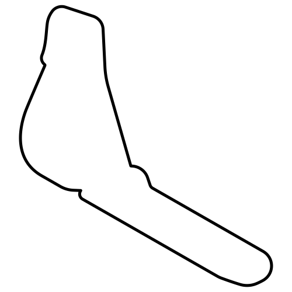
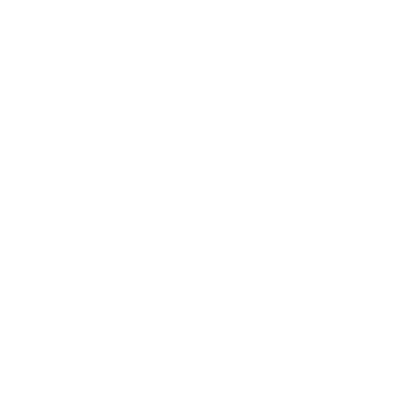
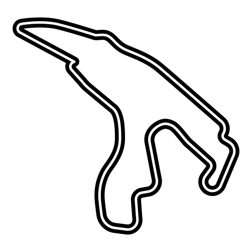

# F1 CIRCUITS SVG

This repository contains the layouts of all the circuits that have hosted at least one world championship Grand Prix in Formula 1 history.

[Pitlane Insider](https://pitlaneinsider.fr/) uses this repository to display circuit layouts.

### 💽 Format :

All files are using [Scalable Vector Graphics (SVG)](https://simple.wikipedia.org/wiki/Scalable_Vector_Graphics) format for optimum quality.

### 🎨 Style :

You can find 4 styles of layouts in this repository :
- White outline :
  
  
  
- White :
  
  
  
- Black outline :
  
  
  
- Black :
  
  

### 🖌️ Customisation :

By default, stroke width is set to 20px for outline, and 5px for inside outline. You can easily customize these files for your own use by modifying `stroke` and `stroke-width` values in the style attribute :

```svg
<svg xml:space="preserve" width="500" height="500" xmlns="http://www.w3.org/2000/svg">
  <path style="fill:none;stroke:custom_color;stroke-width:custom_width;stroke-dasharray:none;stroke-opacity:1;stroke-linejoin:round" d="M363.613 403.265c-71.774.087-143.644.586..."/>
</svg>
```

If needed, you can also customise width and height (default 500px x 500px) by modifying `width` and `height` attributes.

### 🛣️ Included circuits (77/77) :

- Adelaide Street Circuit (Adelaide)
- Ain-Diab Circuit (Casablanca)
- Aintree Motor Racing Circuit (Aintree)
- Algarve International Circuit (Portimão)
- Anderstorp Raceway (Anderstorp)
- Autodromo Internazionale Enzo e Dino Ferrari (Imola)
- Autodromo Internazionale del Mugello (Scarperia e San Piero)
- Autodromo Nazionale Monza (Monza)
- Autódromo Hermanos Rodríguez (Mexico City)
- Autódromo Internacional Nelson Piquet (Rio de Janeiro)
- Autódromo José Carlos Pace (São Paulo)
- Autódromo Juan y Oscar Gálvez (Buenos Aires)
- Autódromo do Estoril (Estoril)
- Automobil-Verkehrs- und Übungs-Straße (Berlin)
- Bahrain International Circuit (Sakhir)
- Baku City Circuit (Baku)
- Brands Hatch (Fawkham)
- Buddh International Circuit (Greater Noida)
- Bugatti Circuit (Le Mans)
- Caesars Palace (Las Vegas)
- Canadian Tire Motorsport Park (Bowmanville)
- Charade Circuit (Clermont-Ferrand)
- Circuit Bremgarten (Bern)
- Circuit Gilles Villeneuve (Montreal)
- Circuit Mont-Tremblant (Mont-Tremblant)
- Circuit Park Zandvoort (Zandvoort)
- Circuit Paul Ricard (Le Castellet)
- Circuit Zolder (Heusden-Zolder)
- Circuit de Barcelona-Catalunya (Montmeló)
- Circuit de Monaco (Monte Carlo)
- Circuit de Nevers Magny-Cours (Nevers)
- Circuit de Spa-Francorchamps (Spa)
- Circuit of the Americas (Austin)
- Circuito da Boavista (Porto)
- Circuito de Jerez (Jerez de la Frontera)
- Circuito de Monsanto (Lisbon)
- Circuito de Montjuïc (Barcelona)
- Circuito del Jarama (Madrid)
- Detroit Street Circuit (Detroit)
- Dijon-Prenois (Dijon)
- Donington Park (Leicestershire)
- Fair Park (Dallas)
- Fuji Speedway (Oyama)
- Hockenheimring (Hockenheim)
- Hungaroring (Budapest)
- Indianapolis Motor Speedway (Indianapolis)
- Istanbul Park (Istanbul)
- Jeddah Corniche Circuit (Jeddah)
- Korea International Circuit (Yeongam)
- Kyalami Racing Circuit (Midrand)
- Las Vegas Street Circuit (Las Vegas)
- Long Beach (Long Beach)
- Losail International Circuit (Lusail)
- Marina Bay Street Circuit (Singapore)
- Melbourne Grand Prix Circuit (Melbourne)
- Miami International Autodrome (Miami Gardens)
- Nivelles-Baulers (Nivelles)
- Nürburgring (Nürburg)
- Okayama International Circuit (Aida)
- Pedralbes Circuit (Barcelona)
- Pescara Circuit (Pescara)
- Phoenix Street Circuit (Phoenix)
- Prince George Circuit (East London)
- Red Bull Ring (Spielberg)
- Reims-Gueux (Reims)
- Riverside International Raceway (Riverside)
- Rouen-Les-Essarts (Rouen)
- Sebring International Raceway (Sebring)
- Sepang International Circuit (Sepang)
- Shanghai International Circuit (Shanghai)
- Silverstone Circuit (Silverstone)
- Sochi Autodrom (Sochi)
- Suzuka Circuit (Suzuka)
- Valencia Street Circuit (Valencia)
- Watkins Glen International (Watkins Glen)
- Yas Marina Circuit (Abu Dhabi)
- Zeltweg (Zeltweg)

*Last review: 08/2024*

```
________ _______ __  __       _________        ______            
___  __ \__  __ \_ \/ /       ______  /____  _____  /_____ ________
__  /_/ /_  / / /__  /        ___ _  / _  / / /__  / _  _ \__  ___/
_  _, _/ / /_/ / _  /         / /_/ /  / /_/ / _  /  /  __/_(__  ) 
/_/ |_|  \____/  /_/          \____/   \__,_/  /_/   \___/ /____/  

```